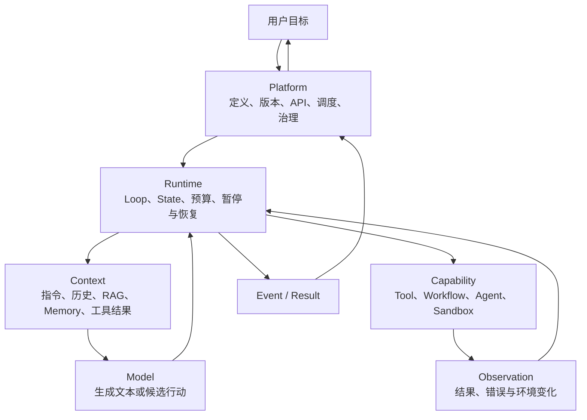
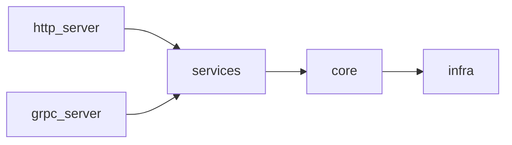

# 第 1 课｜Agent、Workflow 与 Agent Platform 的系统边界

> 所属模块：`00｜Agent 工程导论与学习基线`  
> 建议用时：阅读 25 分钟 + 练习 20 分钟  
> Zeno 对照：`zeno-backend-agent/AGENTS.md`、`ARCHITECTURE.md`、`core/agent/`  
> 本课目标：先获得一张稳定的系统地图，后续再进入每一层的实现。

## 1. 学完后应该能做什么

学完本课，你应该能够：

1. 区分 Chatbot、Agent、Workflow、Copilot 和 Agent Platform；
2. 解释“调用了 LLM”为什么不等于“实现了 Agent”；
3. 用 Model、Context、Runtime、Capability、Platform 五层定位功能和故障；
4. 准确使用 `Run`、`Loop Round`、`Step`、`State` 和 `Event`；
5. 把这些概念映射到 Zeno 的真实目录和一次执行链路。

## 2. 先给出核心结论

**Agent 不是模型，也不是 Prompt。Agent 是一个运行中的软件系统：Runtime 反复让模型根据当前 Context 作出决策，调用被允许的 Capability，读取 Observation，更新 State，直到目标完成或命中终止条件。**

可以先记成：

```text
Agent = Model + Context + Runtime Loop + Capabilities + State + Policies
```

其中任何一个部分都不能被模型“顺便代替”：

- Model 产生候选文本或行动，不负责可靠执行；
- Context 决定本轮模型看见什么；
- Runtime 决定什么时候调用、重试、暂停和结束；
- Capability 负责接触真实环境；
- State 保存当前进展；
- Policies 限制成本、权限和风险。

### 第一个判断题

下面这段程序是不是 Agent？

```python
result = await model.generate("请总结这篇文章")
return result.text
```

它不是 Agent，而是一次 **Model Call 驱动的 LLM 应用**。它没有行动—观察循环，也没有根据环境反馈自主选择下一步。

如果改成：

```python
while not finished:
    context = context_engine.build(state)
    decision = await model.generate(context, tools=allowed_tools)

    if decision.is_final:
        return decision.output

    observations = await tool_executor.execute(decision.tool_calls)
    state = state.apply(decision, observations)
```

现在才出现 Agent Runtime 的最小骨架：**决策、行动、观察、更新、重复**。

## 3. Chatbot、Agent、Workflow、Copilot 不在同一维度

这些词经常被当成互斥产品类型，其实它们描述的维度不同。

| 概念 | 主要描述什么 | 谁控制下一步 | 典型特征 |
|---|---|---|---|
| Chatbot | 交互形态 | 通常由固定程序控制 | 用户发消息，系统回复消息 |
| Workflow | 控制流结构 | 代码、DSL 或状态机 | 节点和边事先定义，可预测、可审计 |
| Agent | 决策执行方式 | 部分由模型动态选择 | 根据 Observation 决定下一行动 |
| Copilot | 产品关系 | 取决于内部实现 | 人是主驾驶，系统提供建议或代办 |
| Agent Platform | 管理和运行基础设施 | 平台策略 + Runtime | 管理定义、版本、执行、权限、Trace 和 Eval |

因此：

- 一个 Chatbot 可以只是一次 Model Call，也可以在内部运行 Agent；
- 一个 Copilot 可以用 Agent，也可以只用搜索和固定 Workflow；
- Workflow 的某个节点可以运行 Agent；
- Agent 可以调用 Workflow，把确定性子流程当成一个 Capability；
- Agent Platform 可以同时承载 Chatbot、Workflow 和 Agent 应用。

### 一个实用判断方法

不要先看 UI 长什么样，而要问三个问题：

1. **下一步由谁决定？**代码、用户，还是模型？
2. **系统能否作用于外部环境？**只是生成文本，还是会查询、修改、执行？
3. **执行能否跨多个步骤持续？**有没有 State、Observation 和终止条件？

## 4. Agent 系统的五层架构

五层不是严格的调用栈。Runtime 位于中心，协调另外四层。



### 4.1 Model：产生候选决策

Model 层处理：

- Message 和 Content；
- Tool Calling；
- Structured Output；
- Streaming；
- Token Usage；
- Provider 适配。

它不应该负责：

- 判断工具是否有权限执行；
- 保证写操作幂等；
- 保存可靠的 Run 状态；
- 决定平台级重试与计费；
- 证明生成内容真实。

### 4.2 Context：决定模型此刻能看见什么

Context 不等于 Prompt。它通常包含：

- System Instructions；
- Conversation History；
- 当前 Run State；
- Tool Schema；
- RAG 检索结果；
- Memory；
- 上一轮 Tool Observation；
- Token Budget 下的裁剪和摘要结果。

同一个模型和 Prompt，在 Context 装配错误时也会表现得像“模型变笨了”。

### 4.3 Runtime：控制执行生命周期

Runtime 是 Agent 成立的关键。它负责：

- 创建和推进 Run；
- 执行 Agent Loop；
- 调用 Model 与 Capability；
- 更新 State；
- 判断终止条件；
- 处理预算、超时、取消、暂停和恢复；
- 产生结构化 Event 和 Result。

后续课程手写的 Mini Runtime，核心就在这一层。

### 4.4 Capability：让 Agent 接触真实世界

Capability 可以是：

- 本地函数或 API Tool；
- MCP Tool；
- 检索器；
- Workflow；
- 另一个 Agent；
- 浏览器、文件系统或代码沙箱。

模型生成 Tool Call 只是“提出行动”。Capability 层执行成功、业务约束通过后，才意味着真实动作成功。

### 4.5 Platform：把一个 Runtime 变成可运营系统

Platform 关心：

- Agent Definition 与版本；
- Model、Prompt、Tool、Knowledge 和 Skill 资产；
- API、Queue、Worker 和 Runtime Pool；
- 多租户、身份、权限和配额；
- Event Store、Checkpoint 和 Artifact；
- Trace、Eval、审计和成本；
- 发布、灰度、回滚和治理。

一个能在本地运行的 Agent Demo，距离 Agent Platform 中间还隔着完整的生产工程层。

## 5. 一次执行中的统一术语

本课程使用 [课程词汇表](../CONTEXT.md) 中的定义。先看一个例子：

> 用户说：“读取仓库的测试报告，找出失败原因并创建修复建议。”

| 术语 | 在这个例子里是什么 |
|---|---|
| Conversation Turn | 从这条用户消息开始，到返回建议或挂起审批为止 |
| Run | Runtime 为这个目标创建的一次可追踪执行 |
| Loop Round 1 | 模型决定先调用“读取测试报告”工具 |
| Step | 构建 Context、调用 Model、执行某个 Tool 都各是一个 Step |
| Observation | 工具返回测试失败栈和文件位置 |
| Loop Round 2 | 模型根据失败栈决定读取相关源码 |
| State | 当前消息、已有证据、预算、执行位置和中间结果的快照 |
| Event | `model_call_started`、`tool_call_completed` 等已发生事实 |
| Result | Run 最终的成功、失败、取消或挂起结果 |

### 最容易混淆的三个边界

#### Run 不等于 Model Call

一个 Run 可以调用模型多次。只统计 API 请求成功率，无法代表 Run 成功率。

#### State 不等于 Event

- State 表示“现在是什么样”；
- Event 表示“刚才发生了什么”。

State 可以被覆盖更新；Event 一旦发布就不应该被改写。

#### Tool Call 不等于业务成功

模型可能正确选择了工具，但仍可能发生：

- 参数 Schema 错误；
- 权限拒绝；
- Provider 路由错误；
- 网络超时；
- 工具返回结构异常；
- 外部系统拒绝业务操作。

所以 Tool Use 的评测必须分层，不能只看模型有没有生成工具名。

## 6. 映射到 Zeno Agent Platform

Zeno 的顶层依赖方向是：



再套入五层模型：

| 五层 | Zeno 主要位置 | 先看什么 |
|---|---|---|
| Model | `core/llm/` | 统一 `llm()` 入口、Relay、Provider |
| Context | `core/context/` | `engine.py`、注入、预算和压缩 |
| Runtime | `core/agent/`、`core/workflow/` | `base.py`、`execution/loop.py`、Workflow Engine |
| Capability | `core/tool/`、`tools/`、`core/rag/`、`infra/sandbox/` | ToolExecutor、Provider、Retriever、Sandbox |
| Platform | `http_server/`、`grpc_server/`、`services/`、`infra/`、`evaluation/` | API、用例编排、存储、租户、评测 |

这里有一个重要观察：**代码目录和概念层不是一一对应的。**

例如 `infra/` 会同时支撑 Platform、Capability 和 Context；`services/` 是平台用例编排，不应该包含 Agent Loop 内部决策。五层模型用于判断职责，不是要求机械地建立五个同名文件夹。

### Zeno 中一次 Run 的核心调用路径

以浏览器对话为例，可以先记住：

```text
http_server
  → services/chat_service.py: chat()
  → core/agent/base.py: Agent.execute()
  → core/agent/base.py: _execute_inner()
  → core/agent/execution/loop.py: AgentLoop.run()
  → _run_unpinned()
  → while True
       ├─ 检查 max_turns / budget
       ├─ 调用 LLM
       ├─ 产生正文或 Tool Call
       ├─ 执行 Tool 并获得 Observation
       └─ 更新状态，进入下一轮或结束
```

当前代码中的关键入口：

- `services/chat_service.py:2533`：`chat()`；
- `core/agent/base.py:397`：`Agent.execute()`；
- `core/agent/base.py:430`：`_execute_inner()`；
- `core/agent/execution/loop.py:298`：`AgentLoop.run()`；
- `core/agent/execution/loop.py:387`：循环体；
- `core/agent/types.py:95`：`ExecutionContext`；
- `core/context/engine.py:127`：`ContextEngine`；
- `core/tool/executor.py:151`：`ToolExecutor`。

这些行号用于本次课程定位，代码演进后应以符号搜索为准。

## 7. 为什么“能跑”还不等于 Agent 工程完成

下面这条成功路径只能证明 Demo 能工作：

```text
用户输入 → 模型选对工具 → 工具成功 → 模型输出正确答案
```

Agent 工程更关心失败路径：

- 模型连续调用同一工具，谁让它停？
- 工具成功执行，但返回内容污染了 Context，谁负责防护？
- SSE 断线重连，历史 Event 会不会丢失或重复？
- Worker 在写操作后、记录成功前崩溃，会不会重复写？
- Run 暂停一天后恢复，使用哪个 Agent Definition 和 Prompt 版本？
- 模型生成了自然语言道歉，但 Result subtype 是失败，平台相信谁？
- 一个租户的 Memory 是否可能进入另一个租户的 Context？

后续所有模块，实际上都在逐项回答这些问题。

## 8. 课堂练习

### 练习 A：给系统分类

对下面四个系统分别判断它主要属于 Model Call 应用、Workflow、Agent、Copilot 还是 Agent Platform。一个系统可以有多个标签，但要说明依据。

1. 用户上传合同，程序固定执行 OCR → 字段提取 → 规则校验 → 入库；
2. 模型可以自行选择搜索、读取网页、再次搜索，直到形成带引用的报告；
3. IDE 中根据当前文件补全下一段代码，但不能读取其他文件或执行命令；
4. 系统允许团队创建、发布和回滚 Agent，并查看每次运行的 Trace、成本和评测结果。

### 练习 B：拆解一次 Run

以“读取失败测试并生成修复建议”为目标，写出：

- 初始 State；
- 至少两个可能的 Loop Round；
- 每轮包含哪些 Step；
- 可能产生的 Event；
- 三个终止条件；
- 一个需要人工审批的位置。

### 练习 C：做目录归因

在 Zeno 中为下列问题选择最先查看的位置：

1. 模型名称为空，Run 没有发生任何 LLM Call；
2. Tool Call 已生成，但参数被判定非法；
3. 检索到的文档太长，模型输入被截断；
4. 浏览器收到重复的流式事件；
5. Agent 配置发布后，旧 Run 无法恢复。

## 9. “这里会怎么坏？”检索题

请先不要翻答案，凭五层模型判断：

> 用户反馈：“Agent 明明显示调用知识库成功，但回答引用了另一个租户的文档。”

回答四个问题：

1. 这是 Model、Context、Runtime、Capability 还是 Platform 的问题？可以选多个，但要标主责；
2. 最先检查的两个数据边界是什么？
3. 在 Zeno 中你会从哪些目录开始查？
4. 哪类测试应该在上线前发现它？

<details>
<summary>完成后查看参考思路</summary>

主责通常在 Context / Capability 的租户过滤边界，Platform 的身份传播和多租户隔离是上游约束。先检查请求中的 tenant identity 是否一直传播到 Retriever，再检查检索查询或索引 namespace 是否应用相同 tenant scope。Zeno 中优先从 `http_server/tenant_deps.py`、`services/knowledge_service.py`、`core/rag/` 和向量存储相关 `infra/` 路径追踪。测试至少应包含跨租户负向集成测试；单纯测试“本租户能搜到文档”发现不了数据泄漏。

</details>

## 10. 本课作业与完成标准

### 必做

1. 完成练习 A、B、C；
2. 不看课程目录，重新画一次五层架构图；
3. 用自己的话写一句 Agent 定义；
4. 在 Zeno 中从 `Agent.execute()` 跟到 `AgentLoop.run()`，记录经过的关键对象。

### 完成标准

- 不再把 Agent、模型和聊天 UI 当成同义词；
- 可以解释 Run 与 Model Call、State 与 Event 的区别；
- 可以依据职责把故障定位到五层之一；
- 可以说出 Zeno 中 Model、Context、Runtime、Capability 和 Platform 的主要代码位置；
- 可以解释“调用 LLM”为什么不是 Agent。

## 11. 下一课预告

下一课进入 `01｜LLM 应用与模型接口基础`：我们不会先学 Prompt 技巧，而是先定义一个可靠的 `ModelClient` 契约，并用 Fake Model 制造文本、Tool Call、空响应、截断、限流和异常，为后面的 Agent Loop 建立可测试输入。

