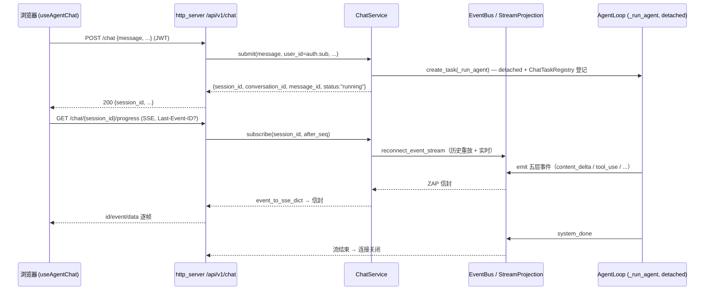

# 两段式对话执行协议 + 统一进度事件

> **Version**: 1.0 · **Status**: Active · **Date**: 2026-07-01
> **关系**：事件语义（信封、五层层级、seq/断线重连）由 [ZAP 规范](./ZAP-SPECIFICATION.md) 定义；本文只定义「**下发 / 订阅解耦**」的两段式接口与其在 HTTP / gRPC / WS 三面的等价映射。不新造事件类型（守 [Channel 协议](./CHANNEL-PROTOCOL.md)）。

---

## 1. 动机

把「发起一轮对话」与「订阅其流式进度」拆成两步、两个连接：

- **断线重连**：订阅断开后可凭 `seq` 续订，不重发 prompt、不重跑 Agent。
- **多端订阅**：同一 `session_id` 可被多个客户端/标签同时订阅。
- **下发即返回**：`POST /chat` 立即拿 `session_id`，Agent 在后端 detached 执行，不阻塞请求连接。

对应 nuwax 的两段式沙箱协议（`POST /chat` + `GET /progress`），但 nwaip 复用自研 Agent Runtime 与既有 ZAP 五层事件，不引入外部词汇。

---

## 2. 契约（浏览器面 / JWT）

### Phase 1 — 提交
```
POST /api/v1/chat          Authorization: Bearer <JWT>
{ "message": "...", "conversation_id"?, "agent_id"?, "model"?, "prompt"?,
  "variables"?, "knowledge_ids"?, "skill_ids"?, "mcp_ids"?, "api_tool_ids"?, "feature"?, "background_tasks"? }
→ 200 APIResponse<{ session_id, conversation_id, message_id, status:"running" }>
```
`user_id` 由 JWT（`auth.sub`）注入，**不在 body**；租户经 `TenantContextDep` 激活 search_path，对齐 gRPC metadata（`x-user-id` / `x-tenant-id` / `x-token-id`）。

### Phase 2 — 订阅（SSE）
```
GET /api/v1/chat/{session_id}/progress     Accept: text/event-stream
      [Last-Event-ID: <seq>]  或  ?after_seq=<seq>
→ text/event-stream，逐帧：
      id: <seq>
      event: <wire type>          # 见 §4；心跳呈现为 heartbeat
      data: <完整 ZAP 信封 JSON>
```
历史重放 + 实时（`reconnect_event_stream`）。空闲插入 `event: heartbeat` 保活。流随后端会话结束自然关闭（不按单个 `message_stop` 提前结束，支持一轮多步工具循环）。session 不存在时以一条 `system_error(SESSION_NOT_FOUND)` 收尾。

### 取消
```
POST /api/v1/chat/{session_id}/cancel   → APIResponse<{ session_id, cancelled: bool }>
```

---

## 3. 三面等价（DoD：HTTP / gRPC 语义一致）

| 阶段 | HTTP（浏览器 / JWT） | gRPC | WS / Channel |
|---|---|---|---|
| 提交（返回 session_id） | `POST /api/v1/chat` | `Chat`(unary) → `ChatResponse.task_id` | `chat.submit`（req→res(accepted)） |
| 订阅（流） | `GET /api/v1/chat/{sid}/progress`（SSE，Last-Event-ID） | `ReconnectStream(session_id, after_seq)` | `event` 帧 |
| 取消 | `POST /api/v1/chat/{sid}/cancel` | `CancelSession` | `task.cancel` |
| 耦合式（便捷保留） | `POST /api/v1/agents/{id}/chat?stream=true`（开放面，见下） | `ChatStream`（发+流一体） | — |

**一致性保证**：三面共用同一服务原语 `ChatService.submit()` / `subscribe()`，产出同一 ZAP 信封（同一 `type` / `seq` / `data`）。gRPC `ChatEvent` 现携带 `event_type` / `seq` / `event_uuid`（与 SSE `event:` / `id:` 行对齐）；断线重连 `after_seq` ≡ SSE `Last-Event-ID`。

> **开放平台面（API-Key）**：现有 `POST /api/v1/agents/{id}/chat` 跑 workflow-DSL 路径、发扁平 `{event,data}` 帧，**尚未**收敛到本协议——两段式化 + 帧收敛与 workflow/skill/mcp 事件统一合并为独立后续课题（见计划「开放问题」）。

---

## 4. 事件与 SSE 帧

事件是 ZAP 五层信封（`conversation_* / message_* / content_* / system_*`，见 ZAP §2）。SSE 单一帧形：

```
id: <seq>                 ← 驱动 Last-Event-ID 重连（= gRPC after_seq）
event: <wire type>        ← 轻标签；sse_event_name(type)：system_ping → heartbeat
data: <完整信封 JSON>      ← {event_uuid, type, session_id, seq, data, _meta?, ...}
```

- **透传 + 轻标签**：稳定 `type` 作轻标签；上游引擎/协议差异（含工具执行状态 `tool_status ∈ pending|running|completed|failed`）挂 `data._meta`（out-of-band），不进受控 schema、不新增事件类型。见 `core/event_bus/wire_contract.py`（`WIRE_META_KEY`）。
- **心跳**：wire 内部 `system_ping`；SSE `event:` 行统一呈现 `heartbeat`（对齐 backend-python / channel 规则与前端）。信封 `type` 两面保持一致。

### nuwax UnifiedSessionMessage ↔ nwaip 五层（交叉引用，仅文档）
| nuwax 7 类 | nwaip 五层（ZAP） |
|---|---|
| `prompt_start` | `message_start`（/ `session_start`、`conversation_start`） |
| `agent_message_chunk` | `content_delta`（`delta.type=text`） |
| `agent_thought_chunk` | `content_delta`（`delta.type=thinking`） |
| `tool_call` | `content_start`（`content_block.type=tool_use`） |
| `tool_call_update` | `content_delta`（`input_json`）+ `content_stop` + `data._meta.tool_status` |
| `end_turn` | `message_stop` / `system_done` |
| `heartbeat` | `system_ping`（SSE `event:` 呈现为 `heartbeat`） |

nwaip 五层更细（block 级 start/delta/stop + index + 签名 + 分块 usage），可无损投影到 nuwax 7 类；反之有损。故保留五层为唯一 canonical，7 类仅作跨文档对照。

---

## 5. 时序



---

## 6. 实现索引

**后端**：`services/chat_service.py`（`submit` / `subscribe` / `cancel_session`）· `services/chat/task_registry.py`（detached 任务保活 + 取消）· `http_server/routers/chat.py` · `http_server/chat_sse.py`（`format_wire_sse` / `wire_streaming_response`）· `grpc_server/chat_servicer.py`（`_to_chat_event` / `Chat` / `ReconnectStream`）· `core/event_bus/wire_contract.py`（`event_to_sse_dict` / `sse_event_name` / `WIRE_META_KEY`）。

**前端**：`src/api/chat.ts` · `src/lib/chatProgressStream.ts`（`id/event/data` 解析 + Last-Event-ID）· `src/lib/chatEventMapper.ts`（五层 → `ChatMessageItem`）· `src/hooks/useAgentChat.ts` · `src/pages/product/AgentChatPage.tsx`（`/chat` 路由）。
